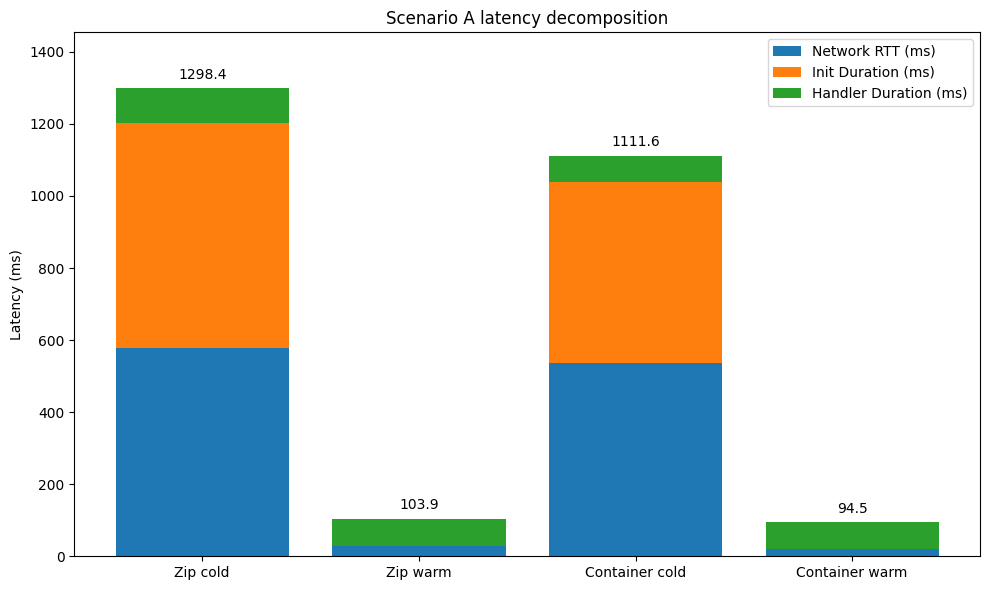
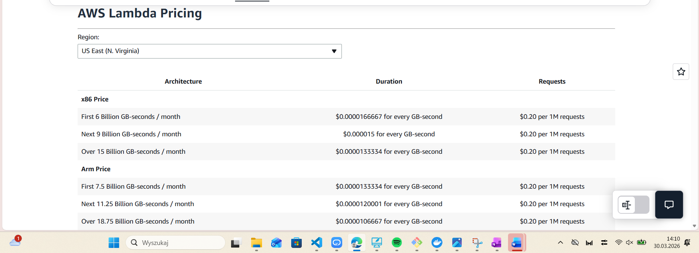
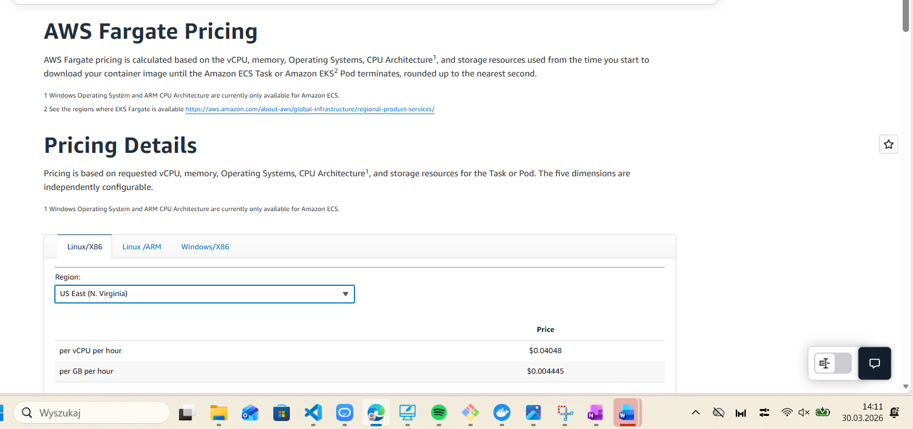
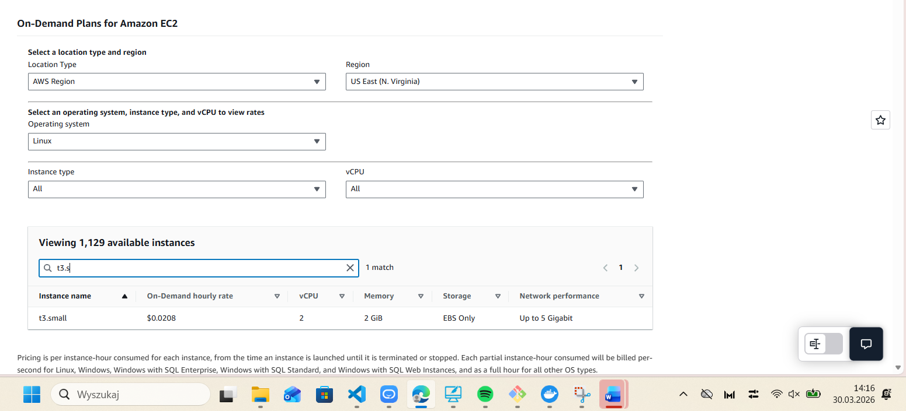

## Assignment 1 

=== Lambda Zip done. Function URL: https://qgfab366kibeatc5dk4byxkzda0dwyid.lambda-url.us-east-1.on.aws/ ===
=== Lambda Container done. Function URL: https://7wox5uei2kdi3anauqvk2pf4v40fshct.lambda-url.us-east-1.on.aws/ ===
=== Fargate done. ALB URL: http://lsc-knn-alb-848748583.us-east-1.elb.amazonaws.com ===

=== EC2 App done. Public IP: 35.175.112.228 ===
URL: http://35.175.112.228:8080

I had problems with configuration but after switching to ec2 everything works correctly.
Details attached in file: assignment-1-endpoints.txt

## Assigment 2

=== Scenario A complete. Results in /home/ec2-user/lsc-lab4-aws-cloud-r2-emila2025/loadtest/../results ===

Details attached in files: 
scenario-a-container.txt
scenario-a-zip.txt
cloudwatch-zip-reports.txt
cloudwatch-container-reports.txt

### Analysis

The stacked bar chart shows that warm invocations are dominated by handler execution, while cold invocations are dominated by initialization plus additional client-side overhead. In this run, the matched container cold start was faster than the zip cold start: about 500.13 ms init + 73.89 ms handler for the container versus about 625.95 ms init + 95.04 ms handler for zip. However, the CloudWatch export for the container also contains a separate 2049.36 ms cold-start entry, which suggests that container cold starts were more variable. A reasonable explanation is that the container image benefited from AWS-side caching in the measured Scenario A run, while zip still paid a larger initialization cost; in general, zip deployments are often expected to cold-start faster because they are smaller and the zip handler avoids extra framework overhead.

## Assignment 3

=== Scenario B complete. Results in /home/ec2-user/lsc-lab4-aws-cloud-r2-emila2025/loadtest/../results ===

Details attached in files:
scenario-b-*.txt 

| Environment | Concurrency | p50 (ms) | p95 (ms) | p99 (ms) | Server avg (ms) |
|---|---:|---:|---:|---:|---:|
| Lambda (zip) | 5 | 94.96 | 114.95 | 139.89 | 66.09 |
| Lambda (zip) | 10 | 91.08 | 113.07 | 149.15 | 66.09 |
| Lambda (container) | 5 | 95.38 | 114.89 | 147.99 | 64.45 |
| Lambda (container) | 10 | 89.27 | 113.03 | 145.22 | 64.45 |
| Fargate | 10 | 793.40 | 1002.10 | 1090.10 | 23.20 |
| Fargate | 50 | 3901.10 | 4192.50 | 4299.30 | 23.20 |
| EC2 | 10 | 193.51 | 262.67 | 290.46 | 22.51 |
| EC2 | 50 | 916.30 | 1074.60 | 1133.20 | 22.51 |

### Analysis

For Scenario B, none of the measured cases show p99 > 2 × p95, so there is no strong evidence of severe tail-latency instability in these runs. The percentile spread is visible, especially for Fargate and EC2 at higher concurrency, but it does not cross the instability threshold required in the assignment.

Lambda’s p50 changes only slightly between concurrency 5 and 10 because Lambda scales by creating separate execution environments for concurrent requests. As a result, requests do not wait in a shared queue and the median latency stays close to the server processing time. In contrast, Fargate and EC2 use a single task or instance in this setup, so when concurrency rises from 10 to 50, requests compete for the same CPU resources and begin to queue, which causes a large increase in p50, p95, and p99.

The difference between server-side query_time_ms and client-side p50 is caused by overhead outside the actual k-NN computation. Client-side latency includes network round-trip time, TCP/TLS connection handling, request transmission, response transmission, and platform overhead such as the ALB in front of Fargate. Therefore, client-side p50 is always much higher than the pure server-side compute time.

# Assignment 4

=== Scenario C complete. Results in /home/ec2-user/lsc-lab4-aws-cloud-r2-emila2025/loadtest/../results ===

Details attached in files: 
scenario-c-*.txt

| Environment | Concurrency | p50 (ms) | p95 (ms) | p99 (ms) | Max (ms) | Cold-start note |
|---|---:|---:|---:|---:|---:|---|
| Lambda (zip) | 10 | 98.5 | 1354.3 | 1443.9 | 1453.7 | Clear bimodal pattern; about 10 requests formed a slow cold-start cluster |
| Lambda (container) | 10 | 97.7 | 2717.8 | 2759.2 | 2763.0 | Clear bimodal pattern; about 10 requests formed a slow cold-start cluster |
| EC2 | 50 | 962.9 | 1244.3 | 1674.5 | 1734.2 | No per-request cold starts; latency mainly reflects queueing and CPU contention |
| Fargate | 50 | 3899.8 | 4362.1 | 4561.0 | 4590.4 | No per-request cold starts; latency mainly reflects queueing and CPU contention |

### Analysis

Lambda’s burst p99 is much higher than Fargate and EC2 because, after 20 minutes of inactivity, the burst forces Lambda to create new execution environments, so cold-start latency is added to some requests. In this lab, Lambda scales per request, and with concurrency capped at 10, the burst produces a set of slow cold-start requests that dominate the tail of the latency distribution. On the other hand, Fargate and EC2 are already running, so they do not pay per-request initialization cost during the burst.

The Lambda results clearly show a bimodal distribution. For the zip deployment, most requests were in the warm cluster around 0.08–0.11 s, while 10 requests formed a cold-start cluster near 1.45 s; this is visible in the histogram with 189 requests near 0.208 s and 10 near 1.454 s. For the container deployment, most requests were again warm around 0.08–0.12 s, while 10 requests formed a much slower cold-start cluster near 2.76 s.

Lambda does not meet the p99 < 500 ms SLO under burst in the default configuration. The measured p99 was about 1.44 s for Lambda zip and about 2.76 s for Lambda container, both far above the 500 ms target. To meet the SLO, Lambda would need a change such as Provisioned Concurrency so that enough execution environments are already warm before the burst arrives.

## Assignment 5

AWS LAMBDA PRICING

AWS FARGATE PRICING

Fargate hourly idle cost = 0.5 × 0.04048 + 1 × 0.004445 = 0.02024 + 0.004445
 = **0.024685 USD/h**

 Fargate monthly idle cost = 0.024685 × 540 = 13.3299 USD ≈ **13.33 USD**

AWS EC2 PRICING

EC2 monthly idle cost = 0.0208 × 540 = 11.232 USD ≈ **11.23 US**

Summary

| Environment | Hourly idle cost (USD/h) | Monthly idle cost for 18h/day idle (USD) |
|---|---:|---:|
| Lambda (zip) | 0.00000 | 0.00 |
| Lambda (container) | 0.00000 | 0.00 |
| Fargate | 0.024685 | 13.33 |
| EC2 (t3.small) | 0.0208 | 11.23 |

Lambda has zero idle cost because, without traffic, there are no requests and no billed execution duration. In contrast, Fargate and EC2 cost while provisioned and running even when no requests are served. Under the assumption of 18 idle hours per day, EC2 t3.small costs about 11.23 USD/month during idle periods, while a single Fargate task costs about 13.33 USD/month.

# Assigment 6

### Monthly cost

Traffic volume:
- Requests/day = 279,000
- Requests/month = 8,370,000
- Average RPS = 3.2292

For Lambda, I used the Scenario B server-side averages as a proxy for handler duration:
- Lambda zip: 66.09 ms
- Lambda container: 64.45 ms

| Environment | Monthly cost (USD) |
|---|---:|
| Lambda (zip) | 6.28 |
| Lambda (container) | 6.17 |
| Fargate | 17.77 |
| EC2 | 14.98 |

### Break-even RPS

- Lambda container vs Fargate: **9.30 RPS**
- Lambda container vs EC2: **7.84 RPS**
- Lambda zip vs Fargate: **9.13 RPS**
- Lambda zip vs EC2: **7.70 RPS**

### Recommendation

Under this traffic model, **Lambda container** is the best cost option. It is cheaper than Lambda zip, EC2, and Fargate.

In Scenario B, Lambda also had the best warm performance. At concurrency 10, Lambda container achieved p50 = 89.27 ms and p99 = 145.22 ms, while Lambda zip had p50 = 91.08 ms and p99 = 149.15 ms. EC2 was slower (p50 = 193.51 ms, p99 = 290.46 ms), and Fargate was the slowest (p50 = 793.40 ms, p99 = 1090.10 ms).

However, **as deployed, none of the environments met the p99 < 500 ms SLO in Scenario C**. The measured p99 values were:
- Lambda zip: 1.4439 s
- Lambda container: 2.7592 s
- EC2: 1.6745 s
- Fargate: 4.5610 s 

Therefore, my recommendation is **Lambda container with Provisioned Concurrency**. It gives the lowest monthly cost and the best warm latency, while Provisioned Concurrency would reduce the cold-start problem seen in the burst test.

This recommendation would change if average load increased above about **9.3 RPS** (vs Fargate) or **7.8 RPS** (vs EC2), because then Lambda would lose its cost advantage.